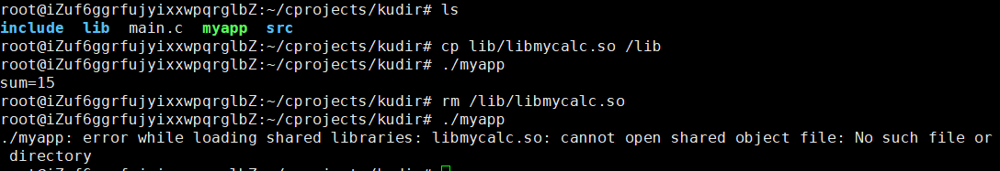
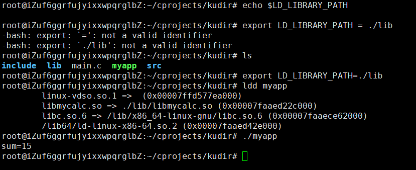
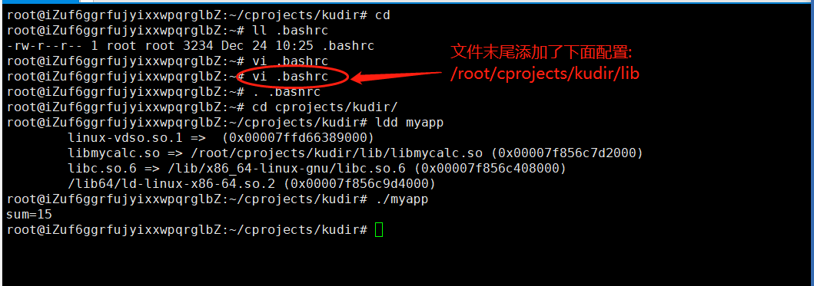
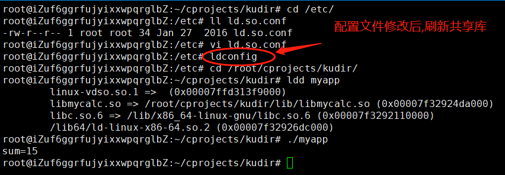

# 开发工具

```
vs2017秘钥:
https://blog.csdn.net/mrobama/article/details/80493146
vs快捷键:
https://www.cnblogs.com/luoguixin/p/6684485.html

qt安装如下:
https://blog.csdn.net/xiongtiancheng/article/details/80036605
```

# Linux易忘指令

- 拷贝本地 token.txt 到远程服务器的 home 目录下，注意 ~ 代表 home 目录,然后提示输入登录密码即可

  ```
  scp token.txt root@47.100.3.249:~
  ```

- 远程服务器传输文件到本地很简单，就是把 scp 命令的两个参数对调一下,然后提示输入登录密码即可

  ```
  scp root@47.100.3.249:~/token.txt token.txt
  ```

  

# Linux静态库制作和使用

- 静态库命名规则

  - lib+库名字+.a
  - libmycalc.a

- 制作步骤

  - 将.c文件生成.o

    ```
    //-I指定头文件目录
    gcc add.c minus.c multi.c divide.c -I../include -c
    
    或者:
    gcc *.c -I../include -c
    
    ```

  - 将.o打包

    ```
    //ar rcs 静态库的名字 原材料
    gcc rcs libmycalc.a add.o minus.o multi.o divide.o 
    或者:
    ar rcs libmycalc.a *.o
    ```

- 库的使用

  ```
  gcc main.c lib/libmycalc.a -I./include -o myapp
  
  或者 
  //-L指定库所在的文件目录路径 -l指定库的名字,注意去掉lib和后面的.a -I指定头文件目录
  gcc main.c -L./lib -lmycalc -I./include -o myapp
  ```

- 实验流程如下图:

  


# Linux动态库的制作和使用

- 动态库命名规则

  - lib+库名字+.so
  - libmycalc.so

- 制作步骤

  - 将源文件生成.o

    ```
    gcc *.c -I../include -fPIC -c
    或者
    gcc add.c minus.c multi.c divide.c -I../include -fPIC -c
    ```

  - 打包

    ```
    gcc *.o -shared -o libmycalc.so
    ```

- 库的使用

  ```
  gcc main.c -Iinclude lib/libmycalc.so -o myapp
  ./myapp
  
  这种方式执行结果ok
  ```

  ```
  gcc main.c -Iinclude -L./lib -lmycalc -o myapp
  ./myapp
  
  结果报错,是由于这种libmycalc.so=>not found
  ```

- 库第二种使用方式的解决方案

  - 第一种 把动态库移到系统的lib目录中,这种**极力不推荐**

    

  - 第二种在当前shell终端中配置LD_LIBRARY_PATH,重启终端将失效,这种方案可以测试使用

    

  - 第三种是在用户名目录下的.bashrc配置文件

    

  - 第四种在系统目录下的/etc/ld.so.conf配置,这种常用

    


# ffmpeg学习

- 参考资料

  ```java
  
  https://juejin.im/post/59b7d2ff5188257e671b71be
  
  http://blog.xigulu.com/2016/08/25/FFMPEG-command/
  
  https://github.com/tonydeng/fmj/blob/master/ffmpeg.md
  
  https://einverne.github.io/post/2015/12/ffmpeg-first.html
  
  https://blog.csdn.net/liangjiubujiu/article/details/80568065
  
  https://www.jianshu.com/p/aac3e2a209c3
  
  https://blog.csdn.net/xuyankuanrong/article/details/77527381
  
  
  ```

  

