# 开发工具

```
vs2017秘钥:
https://blog.csdn.net/mrobama/article/details/80493146
vs快捷键:
https://www.cnblogs.com/luoguixin/p/6684485.html

qt安装如下:
https://blog.csdn.net/xiongtiancheng/article/details/80036605

gcc安装教程
https://blog.csdn.net/u012450329/article/details/53813477
```

# Linux易忘指令

- 拷贝本地 token.txt 到远程服务器的 home 目录下，注意 ~ 代表 home 目录,然后提示输入登录密码即可

  ```
  scp token.txt root@47.100.3.249:~
  ```

- 远程服务器传输文件到本地很简单，就是把 scp 命令的两个参数对调一下,然后提示输入登录密码即可

  ```
  scp root@47.100.3.249:~/token.txt token.txt
  ```

  

# Linux静态库制作和使用

- 静态库命名规则

  - lib+库名字+.a
  - libmycalc.a

- 制作步骤

  - 将.c文件生成.o

    ```
    //-I指定头文件目录
    gcc add.c minus.c multi.c divide.c -I../include -c
    
    或者:
    gcc *.c -I../include -c
    
    ```

  - 将.o打包

    ```
    //ar rcs 静态库的名字 原材料
    gcc rcs libmycalc.a add.o minus.o multi.o divide.o 
    或者:
    ar rcs libmycalc.a *.o
    ```

- 库的使用

  ```
  gcc main.c lib/libmycalc.a -I./include -o myapp
  
  或者 
  //-L指定库所在的文件目录路径 -l指定库的名字,注意去掉lib和后面的.a -I指定头文件目录
  gcc main.c -L./lib -lmycalc -I./include -o myapp
  ```

- 实验流程如下图:

  


# Linux动态库的制作和使用

- 动态库命名规则

  - lib+库名字+.so
  - libmycalc.so

- 制作步骤

  - 将源文件生成.o

    ```
    gcc *.c -I../include -fPIC -c
    或者
    gcc add.c minus.c multi.c divide.c -I../include -fPIC -c
    ```

  - 打包

    ```
    gcc *.o -shared -o libmycalc.so
    ```

- 库的使用

  ```
  gcc main.c -Iinclude lib/libmycalc.so -o myapp
  ./myapp
  
  这种方式执行结果ok
  ```

  ```
  gcc main.c -Iinclude -L./lib -lmycalc -o myapp
  ./myapp
  
  结果报错,是由于这种libmycalc.so=>not found
  ```

- 库第二种使用方式的解决方案

  - 第一种 把动态库移到系统的lib目录中,这种**极力不推荐**

    

  - 第二种在当前shell终端中配置LD_LIBRARY_PATH,重启终端将失效,这种方案可以测试使用

    

  - 第三种是在用户名目录下的.bashrc配置文件

    

  - 第四种在系统目录下的/etc/ld.so.conf配置,这种常用

    


# GDB调试

- 生成可调试的程序,注意调试之前需要安装gdb工具`sudo apt install gdb`,生成的代码步骤如下

  ```
  gcc main.c src/*.c -Iinclude -o app -g
  ```

- 启动gdb调试

  ```
  gdb app
  ```

- 前两步截图如下:

  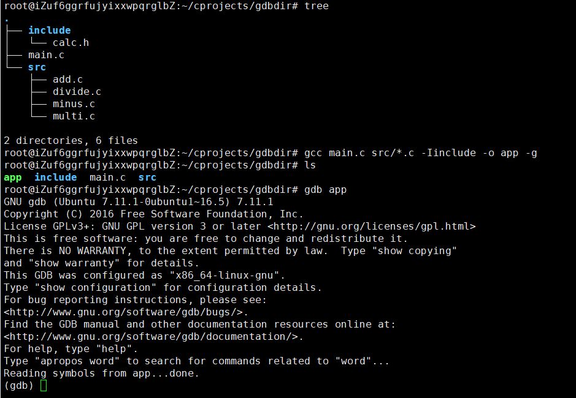

- 

- 设置断点

  ```
  break设置断点,可简写成b
  b 10  表示在当前程序的第10行
  b func  表示在func函数入口处设置断点,比如在主函数中设置断点为`b main`
  ```

- 查看

  ```
  info  查看信息,可简写成i
  i b查看断点信息
  i display 查看display设置的自动显示的信息
  ```

- 调试代码的命令

  ```
  
  run运行程序,可简写成r
  next单步跟踪,可简写成n
  step进入函数体,可简写成s
  finish退出进入的函数
  until退出循环体,可简写成u
  continue继续运行程序,可简写c
  	
  ```


# Makefile制作

1. 第一种对应的文件夹makefiledir1,makefile内容如下,注意第二行前面有个tab键

   ```
   app:main.c src/add.c src/minus.c src/multi.c src/divide.c
   	gcc main.c src/*.c -Iinclude -o app
   ```

   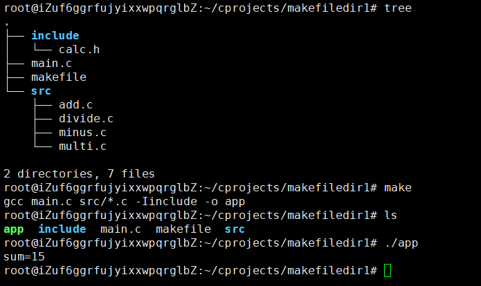

2. 第二种对应的文件夹makefiledir2,makefile内容如下

   - .PHONY:clean是表示clean是个伪目标
   - `rm *.o app -f`是强制清除生成的.o文件和应用,不管有没有生成.o文件和应用

   ```
   app:main.o add.o minus.o multi.o divide.o
   	gcc *.o -o app
   main.o:main.c
   	gcc main.c -Iinclude -c
   add.o:src/add.c
   	gcc src/add.c -Iinclude -c
   minus.o:src/minus.c
   	gcc src/minus.c -Iinclude -c
   multi.o:src/multi.c
   	gcc src/multi.c -Iinclude -c
   divide.o:src/divide.c
   	gcc src/divide.c -Iinclude -c
   .PHONY:clean
   clean:
   	rm *.o app -f
   ```

   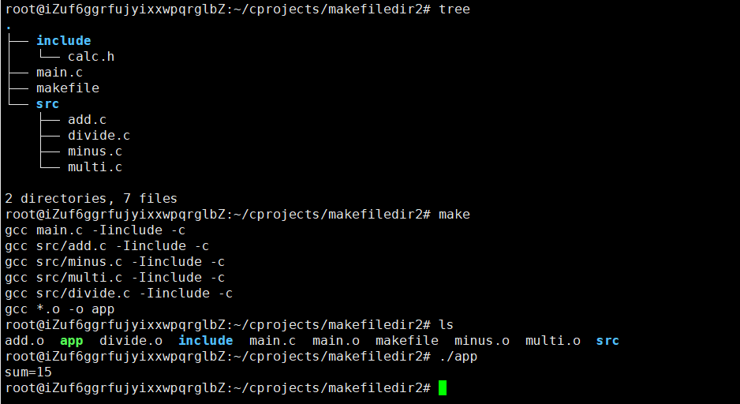

3. 第三种对应的文件夹makefiledir3,makefile内容如下

   ```
   obj=main.o add.o minus.o multi.o divide.o
   target=app
   $(target):$(obj)
   	gcc $(obj) -o $(target)
   main.o:main.c
   	gcc -c $< -Iinclude -o $@
   %.o:src/%.c
   	gcc -c $< -Iinclude -o $@
   ```

   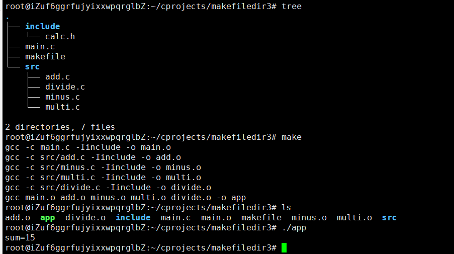

4. 第四种对应的文件夹makefiledir4,makefile内容如下

   ```
   obj=main.o add.o minus.o multi.o divide.o
   target=app
   $(target):$(obj)
   	gcc $(obj) -o $(target)
   main.o:main.c
   	gcc $< -Iinclude -c
   %.o:src/%.c
   	gcc $< -Iinclude -c
   ```

   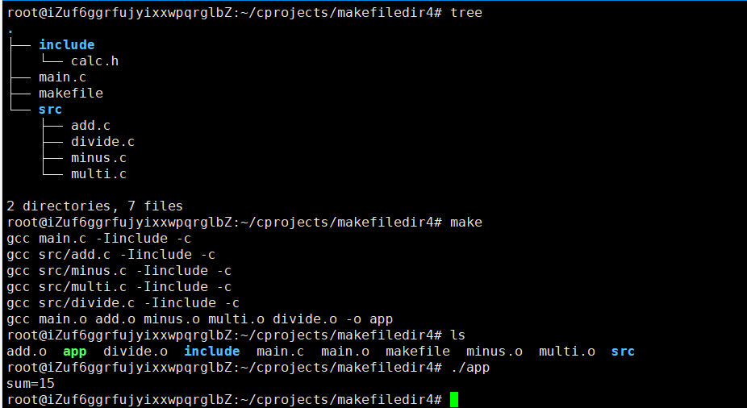

5. 第五种对应的文件夹makefiledir5,makefile内容如下

   ```
   obj=main.o add.o minus.o multi.o divide.o
   target=app
   $(target):$(obj)
   	gcc $(obj) -o $(target)
   %.o:%.c
   	gcc -c $< -o $@
   
   ```

   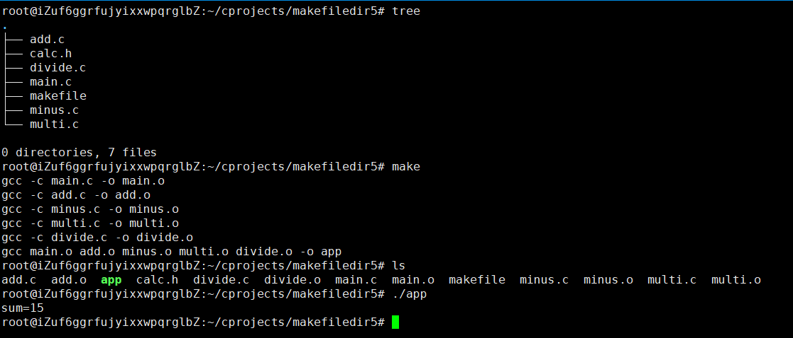

6. 第五种对应的文件夹makefiledir6,makefile内容如下

   ```
   #obj=main.o add.o minus.o multi.o divide.o
   target=app
   src=$(wildcard ./*.c)
   obj=$(patsubst ./%.c,./%.o,$(src))
   CC = gcc
   CPPFLAGS = -I
   $(target):$(obj)
   	$(CC) $(obj) -o $(target)
   %.o:%.c
   	$(CC) -c $< -o $@
   #标识clean为伪目标,主要是解决本地有个叫clean的文件
   .PHONY:clean 
   clean:
   	rm $(obj) $(target) -f  #-f是强制删除,不管生成文件与否
   hello:
   	echo "hello makefile"
   ```

   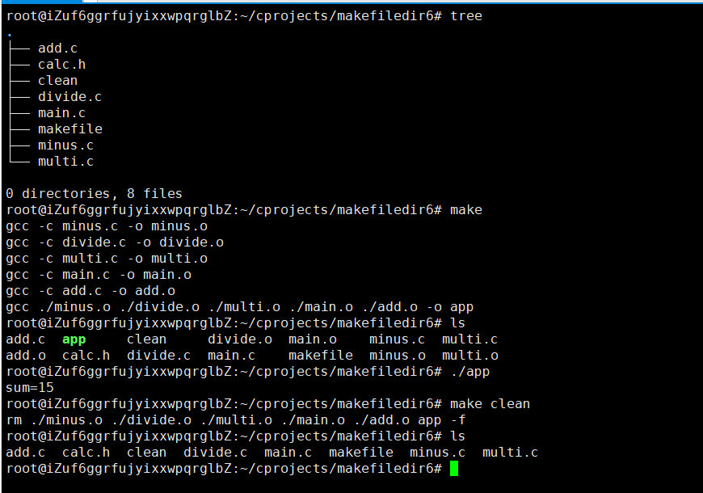


# ffmpeg学习

- 参考资料

  ```java
  
  https://juejin.im/post/59b7d2ff5188257e671b71be
  
  http://blog.xigulu.com/2016/08/25/FFMPEG-command/
  
  https://github.com/tonydeng/fmj/blob/master/ffmpeg.md
  
  https://einverne.github.io/post/2015/12/ffmpeg-first.html
  
  https://blog.csdn.net/liangjiubujiu/article/details/80568065
  
  https://www.jianshu.com/p/aac3e2a209c3
  
  https://blog.csdn.net/xuyankuanrong/article/details/77527381
  
  
  ```

  

# qt打包

- 如下图生成选中后`ctrl+r`运行生成一个release包

  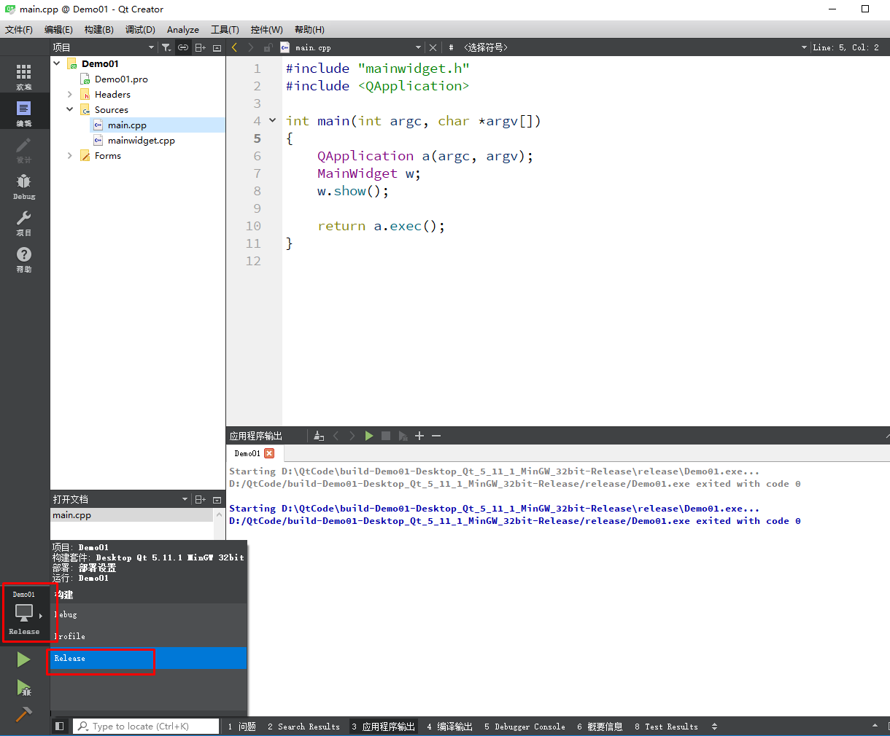

  

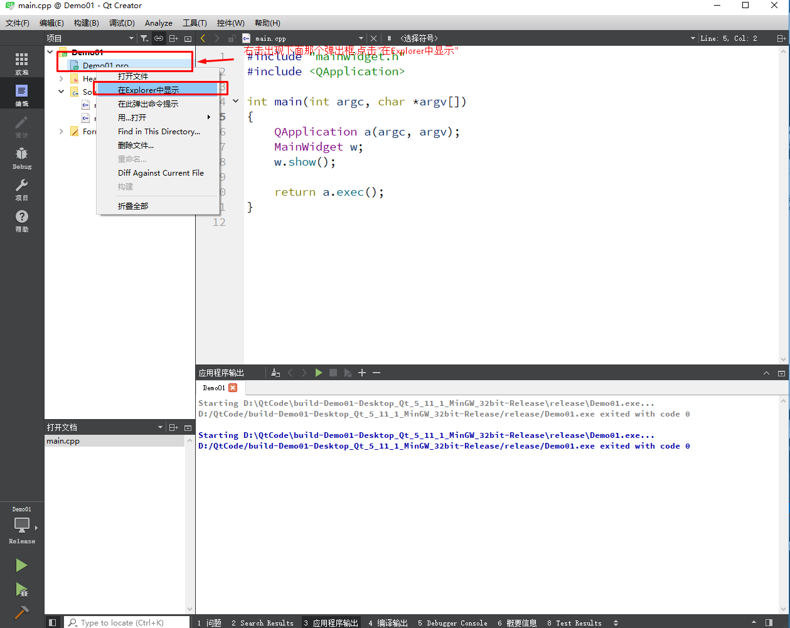

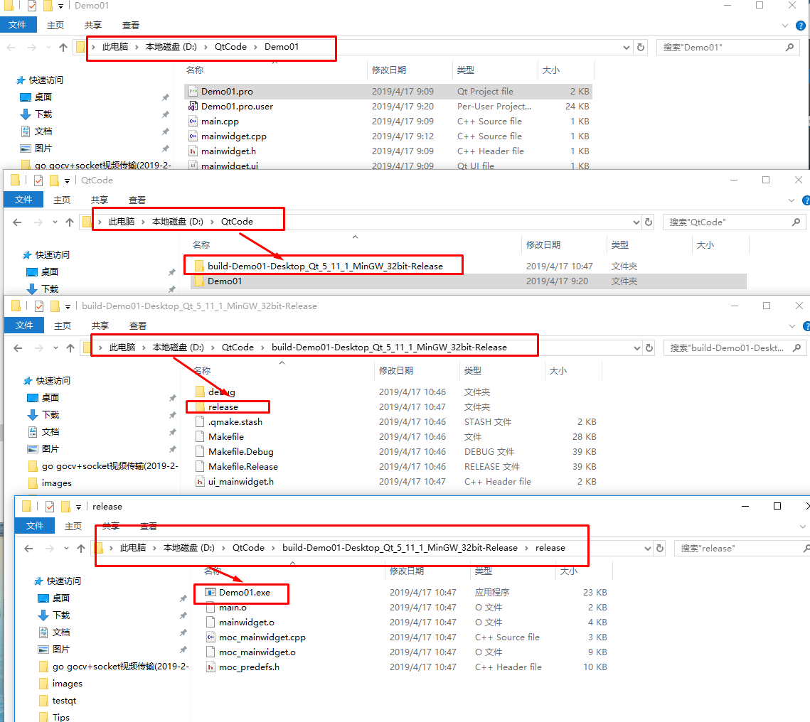


- 找到上图所在路径的`Demo01.exe"并拷贝到一个空文件中,这里以桌面的`release`文件夹为例,并进入到release文件夹下

  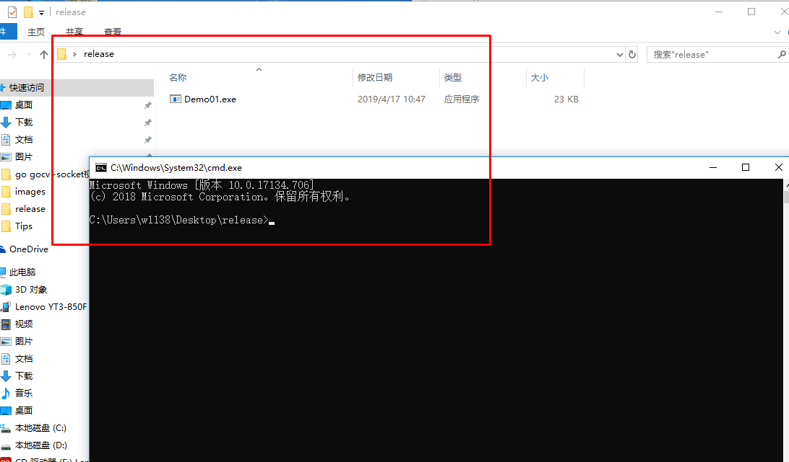

  执行命令`windeployqt Demo01.exe`结果如下图

  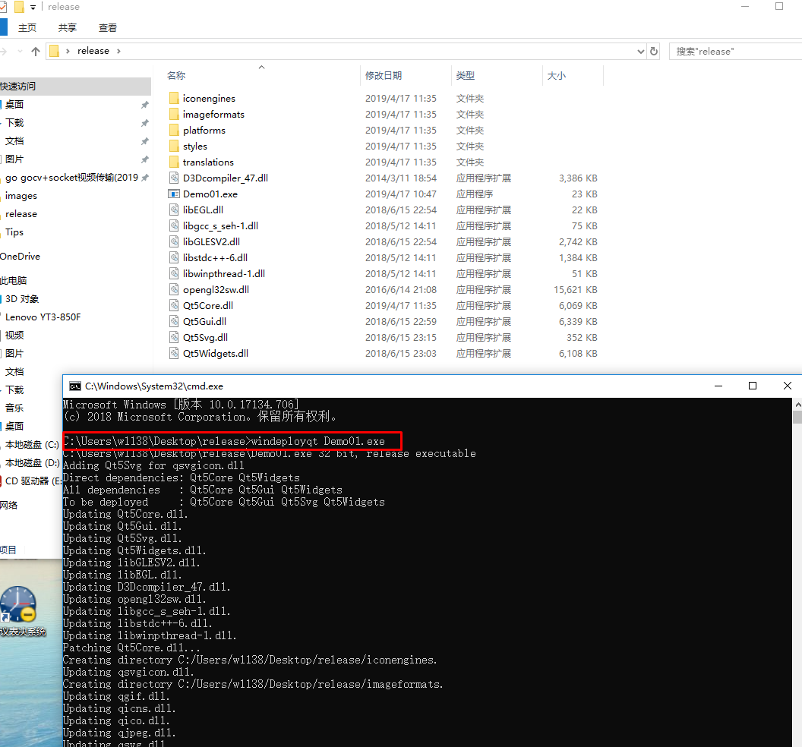

- 再到qt所在的环境变量路径,这里是`C:\Qt\Qt5.11.1\5.11.1\mingw53_32\bin`

  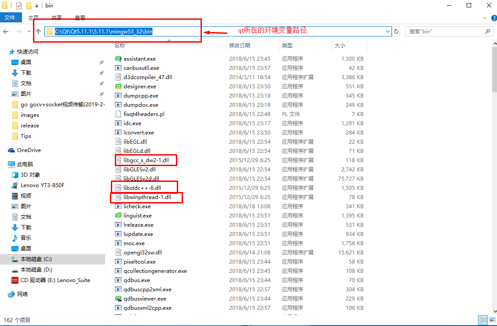

- 拷贝上图中的`libgcc_s_dw2-1.dll`,`libstdc++-6.dll`,`libwinpthread-1.dll`

  放到之前的`release`包下,**并替换所有的文件**

  


