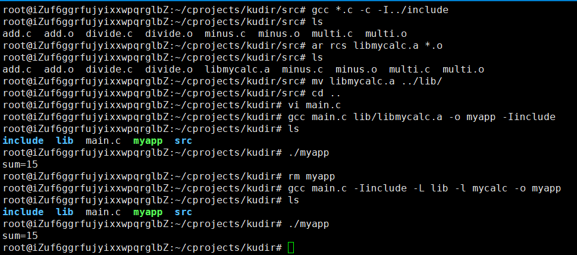

# 标题的使用

  使用 # 来表示标题，井号的数量表示标题的级别 ，总共六级标题。# 和文本之间有个空格

```
# 一级标题
 
## 二级标题
 
### 三级标题
 
#### 四级标题
 
##### 五级标题
```


# 链接的使用

`格式：[超链接说明](超链接地址) `

```
[百度](https://www.baidu.com)
```

效果如下:

[百度](https://www.baidu.com)


# 图片的使用

` 格式： ![图片的说明][图片的超链接地址]`可以设置本地图片和网络图片

- 本地图片``效果如下

  

- 设置网络图片``效果如下

  


# 引用的使用

  只需要在文本前加入 `>` 这种尖括号（大于号）即可

```
> 春眠不觉晓,处处闻啼鸟
```

效果:

> 春眠不觉晓,处处闻啼鸟


# 粗体和斜体

```
**this is blod style**
 
*this is xie style*
```

效果如下:

**this is blod style**

*this is xie style*


# 换行和分割线

- 换行

  `春眠不觉晓,处处闻啼鸟.<br>夜来风雨声,花落知多少.`

  效果:

  春眠不觉晓,处处闻啼鸟.<br>夜来风雨声,花落知多少.

- 分割线

  用三个星号代表一个分割线：*** 

  ```
  
  ***
   this is fen ge xian
  ***
  ```

  效果如下:

  ***

  this is fen ge xian

  ***

# 无序列表

使用*,+,-i表示无序列表

```
- apple
- banana
- orange
```

效果如下:

- apple
- banana
- orange


# 有序列表

  使用数字和点表示有序列表。

```
1. apple
2. banana
3. orange
```

效果如下:

1. apple
2. banana
3. orange


# 删除线

- 使用~~表示删除线

```
~~这是一段错误的文本。~~
```

效果如下:

~~这是一段错误的文本。~~


# 行内代码块

用 `开头 ， 然后用 `结尾 。

```
让我们聊聊 `html`。
 
行内代码块 `这是一个行内代码块 `
```

效果如下:

让我们聊聊 `html`。

行内代码块 `这是一个行内代码块 `


# 待办事项和已办事项

`格式:- [ ]`


```
   
   待办事项1
   - [ ] 待办事项2
   - [x] 已办事项1
   - [x] 已办事项2
```

效果如下:


- [ ] 待办事项1
- [ ] 待办事项2
- [x] 已办事项1
- [x] 已办事项2


# 字体颜色使用

```
<font face="微软雅黑" >微软雅黑字体</font>
<font face="黑体" >黑体</font>
<font size=3 >3号字</font>
<font size=4 >4号字</font>
<font color=#FF0000 >红色</font>
<font color=#008000 >绿色</font>
<font color=#0000FF >蓝色</font>
```

效果如下:

<font face="微软雅黑" >微软雅黑字体</font>

<font face="黑体" >黑体</font>

<font size="3" >3号字体</font>

<font size="4">4号字体</font>

<font color="#f00">红色字体</font>

<font color="#0f0">绿色字体</font>

<font color="#00f">蓝色字体</font>