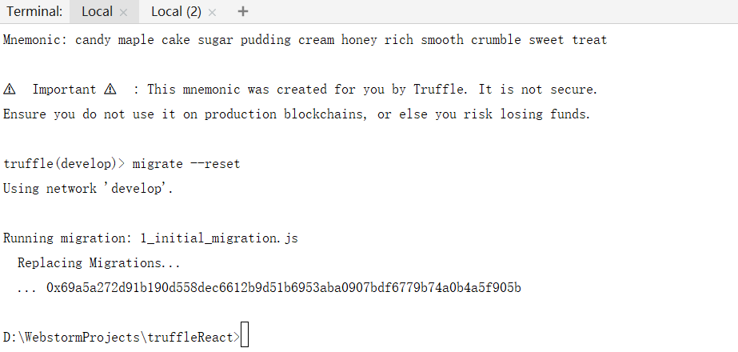
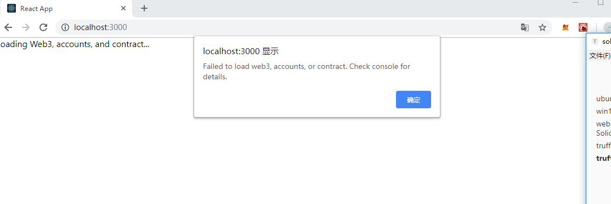
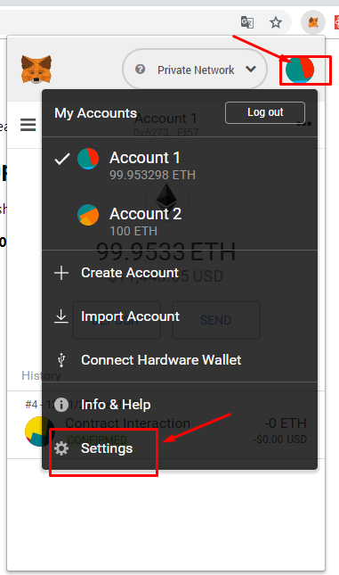
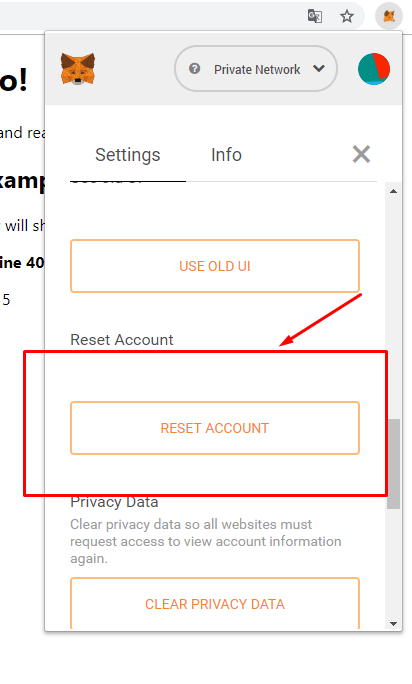
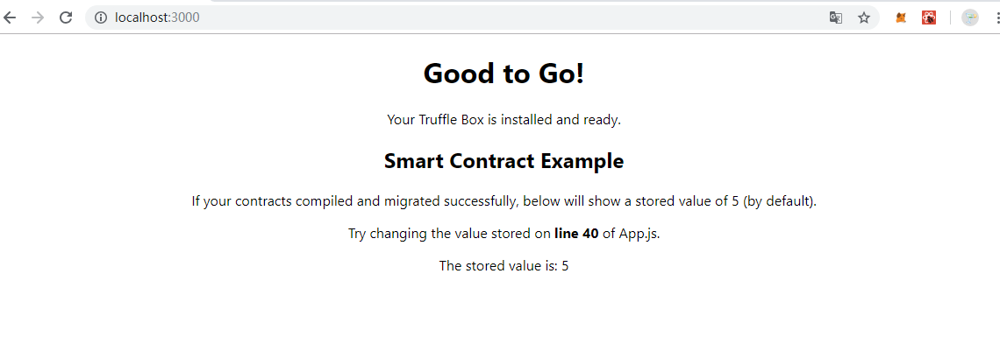

# ubuntu安装Node

- 安装

  ```
  sudo apt update
  sudo apt-get install nodejs-legacy nodejs
  sudo apt-get install npm
  ```

- 安装n来管理版本

  ```
  sudo npm install -g n
  
  sudo n lts 长期支持
  sudo n stable 稳定版
  sudo n latest 最新版
  sudo n 8.4.0 直接指定版本下载
  ```

- 切换版本

  ```
  sudo n
  直接键盘上下移动选择你要的版本，回车确认
  ```

  或者直接指定版本

  ```
  sudo n 8.10.0
  ```

- 查看版本

  ```
  node -v
  npm -v
  
  ```

- 常⻅错误：

  - json parse faild }....@sol

  - 解决办法:

    ```
    npm cache clean --force
    ```


# win10配置web3环境(PowerShell执行)

> 若安装web3报错, 注意,部分windows电脑可能要安装的工具

- 执行如下代码安装window所需要的编译的环境,如果还报错可以尝试安装visual studio

  ```
  npm install --global --production windows-build-tools 
  
  ```

- git 需要执行如下命令

  ```
  git config --global url.https://github.com/.insteadOf git://github.com/
  
  ```

- 上述安装window编译工具的过程中会安装python2,如果window没有配置,我们需要自己手动配置

  - 先找到python.exe所在的目录,一般如下

    ```
    C:\Users\w1138\.windows-build-tools\python27\python.exe
    
    ```

  - 执行如下命令

    ```
    npm config set python "C:\Users\w1138\.windows-build-tools\python27\python.exe"
    ```

# 

# webstorm 开发智能合约需要安装Intellij-Solidity代码提示的插件


# truffle 框架使用

- 安装

  ```
  npm install -g truffle@4.1.12
  ```

- 在win10上,在ganache图形界面客户端打开的情况下,在gitbash执行如下命令

  ```
  w1138@DESKTOP-4ETLG7Q MINGW64 /d/WebstormProjects
  $ mkdir truffleInit
  
  w1138@DESKTOP-4ETLG7Q MINGW64 /d/WebstormProjects
  $ ls
  lottery/  TestDemo/  TransferDemo/  truffleInit/
  
  w1138@DESKTOP-4ETLG7Q MINGW64 /d/WebstormProjects
  $ cd truffleInit/
  
  w1138@DESKTOP-4ETLG7Q MINGW64 /d/WebstormProjects/truffleInit
  $ ls
  
  w1138@DESKTOP-4ETLG7Q MINGW64 /d/WebstormProjects/truffleInit
  $ truffle init
  
  - Preparing to download
  √ Preparing to download
  - Downloading
  × Downloading
  Error: Error: Error: Error making request to https://raw.githubusercontent.com/truffle-box/bare-box/master/truffle-box.json. Got error: connect ETIMEDOUT 151.101.72.133:443. Please check the format of the requested resource.
      at Object.unbox (C:\Users\w1138\AppData\Roaming\npm\node_modules\truffle\build\webpack:\packages\truffle-box\box.js:65:1)
      at process._tickCallback (internal/process/next_tick.js:68:7)
  Truffle v5.0.0 (core: 5.0.0)
  Node v10.13.0
  
  ```

- 关闭了ganache图形客户端后,再次执行命令居然ok了

  ```
  w1138@DESKTOP-4ETLG7Q MINGW64 /d/WebstormProjects/truffleInit
  $truffle init
  
  - Preparing to download
  √ Preparing to download
  - Downloading
  √ Downloading
  - Cleaning up temporary files
  √ Cleaning up temporary files
  - Setting up box
  √ Setting up box
  
  Unbox successful. Sweet!
  
  Commands:
  
    Compile:        truffle compile
    Migrate:        truffle migrate
    Test contracts: truffle test
  
  ```

- 有时候执行如下命令可能会报错,关闭webstorm再重新打开,再次执行又好了

  ```
  truffle migrate --network ganacheNet
  ```

- 执行`truffle test'报错如下:

  ```
  D:\WebstormProjects\truffleinit>truffle test
  Could not connect to your Ethereum client. Please check that your Ethereum client:
      - is running
      - is accepting RPC connections (i.e., "--rpc" option is used in geth)
      - is accessible over the network
      - is properly configured in your Truffle configuration file (truffle.js)
  
  ```

  原因在于`truffle-config.js`中配置的development如下:

  ```
  module.exports = {
      networks: {
          development: {
              host: "127.0.0.1",     // Localhost (default: none)
              port: 8545,            // Standard Ethereum port (default: none)
              network_id: "*",       // Any network (default: none)
          },
      },
   }
  ```

  默认情况下执行`truffle test`默认会找到development配置为9545的端口,现在我们配置了8545,覆盖了9545,所以只需把development配置注释就好了


# truffle结果react的部署流程

- webstorm下的控制台打开一个Local,执行如下命令

  ```
  D:\WebstormProjects\truffleReact>truffle develop
  Truffle Develop started at http://127.0.0.1:9545/
  
  Accounts:
  (0) 0x627306090abab3a6e1400e9345bc60c78a8bef57
  (1) 0xf17f52151ebef6c7334fad080c5704d77216b732
  (2) 0xc5fdf4076b8f3a5357c5e395ab970b5b54098fef
  (3) 0x821aea9a577a9b44299b9c15c88cf3087f3b5544
  (4) 0x0d1d4e623d10f9fba5db95830f7d3839406c6af2
  (5) 0x2932b7a2355d6fecc4b5c0b6bd44cc31df247a2e
  (6) 0x2191ef87e392377ec08e7c08eb105ef5448eced5
  (7) 0x0f4f2ac550a1b4e2280d04c21cea7ebd822934b5
  (8) 0x6330a553fc93768f612722bb8c2ec78ac90b3bbc
  (9) 0x5aeda56215b167893e80b4fe645ba6d5bab767de
  
  Private Keys:
  (0) c87509a1c067bbde78beb793e6fa76530b6382a4c0241e5e4a9ec0a0f44dc0d3
  (1) ae6ae8e5ccbfb04590405997ee2d52d2b330726137b875053c36d94e974d162f
  (2) 0dbbe8e4ae425a6d2687f1a7e3ba17bc98c673636790f1b8ad91193c05875ef1
  (3) c88b703fb08cbea894b6aeff5a544fb92e78a18e19814cd85da83b71f772aa6c
  (4) 388c684f0ba1ef5017716adb5d21a053ea8e90277d0868337519f97bede61418
  (5) 659cbb0e2411a44db63778987b1e22153c086a95eb6b18bdf89de078917abc63
  (6) 82d052c865f5763aad42add438569276c00d3d88a2d062d36b2bae914d58b8c8
  (7) aa3680d5d48a8283413f7a108367c7299ca73f553735860a87b08f39395618b7
  (8) 0f62d96d6675f32685bbdb8ac13cda7c23436f63efbb9d07700d8669ff12b7c4
  (9) 8d5366123cb560bb606379f90a0bfd4769eecc0557f1b362dcae9012b548b1e5
  
  Mnemonic: candy maple cake sugar pudding cream honey rich smooth crumble sweet treat
  
  ⚠️  Important ⚠️  : This mnemonic was created for you by Truffle. It is not secure.
  Ensure you do not use it on production blockchains, or else you risk losing funds.
  
  truffle(develop)> compile
  Compiling .\contracts\Migrations.sol...
  Compiling .\contracts\SimpleStorage.sol...
  Writing artifacts to .\client\src\contracts
  
  truffle(develop)> migrate
  Using network 'develop'.
  
  Running migration: 1_initial_migration.js
    Deploying Migrations...
    ... 0x69a5a272d91b190d558dec6612b9d51b6953aba0907bdf6779b74a0b4a5f905b
    Migrations: 0x8cdaf0cd259887258bc13a92c0a6da92698644c0
  Saving successful migration to network...
    ... 0xd7bc86d31bee32fa3988f1c1eabce403a1b5d570340a3a9cdba53a472ee8c956
  Saving artifacts...
  Running migration: 2_deploy_contracts.js
    Deploying SimpleStorage...
    ... 0xb5dde5e8fb4ba2ee2680a69cf363bd04944f4bac69342889a2db7b37ad2a16e9
  
  ```

- 在Local2中执行如下命令

  ```
  npm run start
  ```

- 根据页面的metamask提示导入Local生成的助记词,助记词如下:

  ```
  candy maple cake sugar pudding cream honey rich smooth crumble sweet treat
  ```

- 如果上述步骤部署好之后仍然出错:

  - bug模式如下图

    


    

    > 1.Local中已经退出了develop模式,而Local2中执行了`npm run start`,会报错
    >
    > 2.报错由于本地http://127.0.0.1:9545服务关闭了


  - 在Local中控制台,执行如下命令,就一条命令`migrate --reset`

    ```
    truffle(develop)> migrate --reset
    Using network 'develop'.
    
    Running migration: 1_initial_migration.js
      Replacing Migrations...
      ... 0x69a5a272d91b190d558dec6612b9d51b6953aba0907bdf6779b74a0b4a5f905b
      Migrations: 0x8cdaf0cd259887258bc13a92c0a6da92698644c0
    Saving successful migration to network...
      ... 0xd7bc86d31bee32fa3988f1c1eabce403a1b5d570340a3a9cdba53a472ee8c956
    Saving artifacts...
    Running migration: 2_deploy_contracts.js
      Replacing SimpleStorage...
      ... 0xb5dde5e8fb4ba2ee2680a69cf363bd04944f4bac69342889a2db7b37ad2a16e9
      SimpleStorage: 0x345ca3e014aaf5dca488057592ee47305d9b3e10
    Saving successful migration to network...
      ... 0xf36163615f41ef7ed8f4a8f192149a0bf633fe1a2398ce001bf44c43dc7bdda0
    Saving artifacts...
    
    ```

  - 在页面metamask中创建本地测试网络,先点击步骤1,然后生成本地网络后的结果如下:

    

  - 按照如下两个步骤重置账号

    


  


      - 重新刷新一下react页面会出现如下结果,表示成功

  ​	